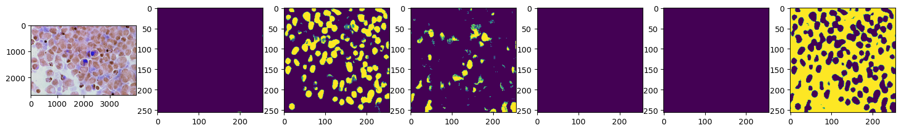

# cancer-segmentation-API

[](https://opensource.org/licenses/MIT)



## Overview


## Key Features

- **Precise Segmentation:** The API can accurately delineate cancerous regions within medical images, providing crucial information for medical professionals.

- **User-friendly Interface:** We have designed the API to be easy to use and integrate into existing healthcare systems and research pipelines.

- **Efficient Processing:** Thanks to the power of TensorFlow, our API is highly efficient, making it suitable for handling large-scale medical image data.

## Installation

To use the Cancer Segmentation API, you need to have Python installed. Clone this repository to your local machine and navigate to the project directory.

```bash
git clone https://github.com/Tushar351/cancer-segmentation
cd cancer-segmentation
